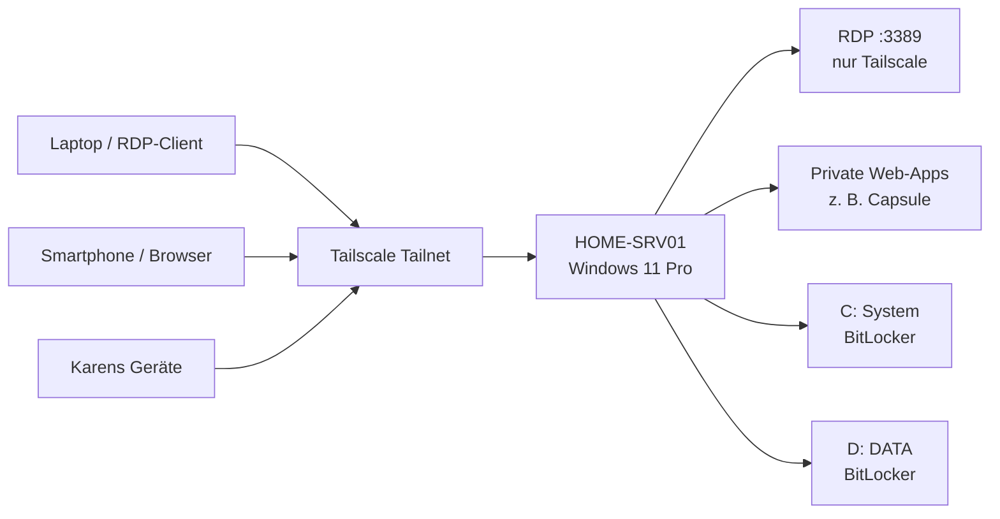

# HOME-SRV01 — Einrichtungs-, Sicherheits- und Betriebsdokumentation

**Stand:** 30.07.2026
**System:** `HOME-SRV01`
**Zweck:** Privater Windows-Heimserver als langfristiger Ersatz für den bisherigen Online-Windows-VPS
**Betriebsmodell:** Nicht öffentlich exponiert; Zugriff ausschließlich über das private Tailscale-Netzwerk und RDP
**Dokumenttyp:** As-built-Dokumentation, Handover und Grundlage für das Methodik-Projekt

---

## 1. Zielbild

`HOME-SRV01` soll als privater, dauerhaft erreichbarer Windows-Server für persönliche Software- und KI-Projekte dienen. Das Gerät ersetzt perspektivisch den bisherigen Online-Windows-VPS.

Der Server ist nicht für öffentliche Internetdienste, kommerzielle Nutzung oder hochkritische Produktionsworkloads vorgesehen. Der Schwerpunkt liegt auf:

- komfortablem Fernzugriff,
- robuster Grundsicherheit,
- sauberer Trennung von normalen und administrativen Konten,
- verschlüsselter lokaler Speicherung,
- minimaler Angriffsfläche,
- reproduzierbarer Einrichtung,
- späterer Migration privater Projekte wie Capsule/Wardrobe Studio,
- privatem Webzugriff über Tailscale statt öffentlicher Portfreigaben.

### Sicherheitsprinzipien

1. **Keine direkte Freigabe von RDP oder Webdiensten ins öffentliche Internet.**
2. **Kein Port-Forwarding an der FRITZ!Box.**
3. **Fernzugriff nur über Tailscale.**
4. **Normale Nutzung mit Standardkonto, Administration mit separatem Administratorkonto.**
5. **BitLocker-Verschlüsselung für beide internen SSDs.**
6. **Secure Boot und TPM aktiv.**
7. **Windows Defender und Windows Firewall bleiben aktiv.**
8. **Recovery-Schlüssel und Backups müssen außerhalb des Servers liegen.**

---

## 2. Systemübersicht

### 2.1 Hardware

| Komponente | Wert |
|---|---|
| Hersteller / Modell | HP EliteDesk 800 G6 Desktop Mini |
| CPU | Intel Core i5-10500T |
| Arbeitsspeicher | 32 GB RAM |
| System-SSD | SK hynix PC711 HFS512GDE9X073N, nominal 512 GB |
| Daten-SSD | UMIS RPETJ512MGE2QDQ, nominal 512 GB |
| Netzwerk | WLAN während Einrichtung; Ethernet später empfohlen |
| TPM | Infineon (`IFX`), Version `7.85.4555.0` |
| UEFI / Secure Boot | Secure Boot aktiv |
| BIOS | HP BIOS, Version 02.26.00 vom 04.05.2026 laut HP Image Assistant |

### 2.2 Betriebssystem

| Merkmal | Wert |
|---|---|
| Betriebssystem | Windows 11 Pro |
| Gerätestand | 24H2 während Einrichtung |
| Lizenzkanal | `OEM_DM channel` |
| Aktivierung vor Neuinstallation | dauerhaft aktiviert |
| OEM-Key | im UEFI/BIOS vorhanden und separat notiert |
| Gerätename | `HOME-SRV01` |

> Hinweis: Das Gerät läuft nicht mit Windows Server, sondern mit Windows 11 Pro als privatem Heimserver. Windows 11 Pro unterstützt RDP als Zielsystem und ist für diesen privaten Einsatzzweck ausreichend.

### 2.3 Datenträgerlayout

| Datenträger | Modell | Laufwerk | Zweck | Dateisystem | Verschlüsselung |
|---|---|---:|---|---|---|
| Disk 0 | SK hynix PC711 | `C:` | Windows, Programme, System | NTFS | BitLocker, XTS-AES 128 |
| Disk 1 | UMIS RPETJ512MGE2QDQ | `D:` / Label `DATA` | Projektdaten und Anwendungsdaten | NTFS | BitLocker, XTS-AES 128 |
| USB-Stick | USB DISK 3.0 | temporär | Windows-Installationsmedium | Installationsmedium | nicht relevant |

Beide internen SSDs meldeten während der Einrichtung:

- `HealthStatus: Healthy`
- `OperationalStatus: Online/OK`

---

## 3. As-built-Architektur



### Netzwerkgrenzen

- **Öffentliches Internet:** keine direkte Veröffentlichung des Servers.
- **Heimnetz:** RDP auf der normalen LAN-/WLAN-IP ist blockiert.
- **Tailscale:** RDP ist über die Tailscale-IP erlaubt.
- **FRITZ!Box:** keine Portfreigabe für TCP/UDP 3389.
- **Webanwendungen:** später bevorzugt über Tailscale Serve und private HTTPS-Adresse.

### Beobachtete Adressen während der Einrichtung

| Zweck | Adresse |
|---|---|
| Tailscale-IP `HOME-SRV01` | `100.116.230.81` |
| Heimnetz-IP während Test | `192.168.178.67` |
| Tailscale-IP des Test-Laptops | `100.67.145.119` |

> Diese Adressen sind dokumentierte Beobachtungen vom Einrichtungszeitpunkt. Die Heimnetz-IP kann sich ohne DHCP-Reservierung ändern. Für den normalen Betrieb sollte bevorzugt der Tailscale-Hostname oder die Tailscale-IP verwendet werden.

---

## 4. Durchgeführte Einrichtung

## 4.1 Ausgangszustand geprüft

Vor der Neuinstallation wurde der bestehende Refurbisher-Zustand untersucht.

### Gefundene Konten vor Neuinstallation

- integriertes Konto `Administrator`, deaktiviert
- Konto `PC`, aktiviert, Administrator, zunächst ohne Kennwort
- `CodexSandboxOffline`
- `CodexSandboxOnline`
- Windows-Systemkonten wie `DefaultAccount`, `Gast`, `WDAGUtilityAccount`

Es war keine klassische Registry-basierte automatische Anmeldung über `AutoAdminLogon` konfiguriert. Windows startete ohne Kennwortabfrage, weil das Konto `PC` kein Kennwort verlangte.

Das Konto `PC` wurde vor der Neuinstallation mit einem Kennwort abgesichert und die Anmeldung erfolgreich getestet.

### Lizenzprüfung vor Neuinstallation

Ausgabe:

```text
Windows(R), Professional edition
OEM_DM channel
LicenseStatus: 1
```

Zusätzlich wurde bestätigt:

```text
Windows ist dauerhaft aktiviert.
```

Der im UEFI hinterlegte OEM-Key wurde ausgelesen und separat notiert.

### Datenträgerprüfung vor Neuinstallation

```text
Disk 0: SK hynix PC711 HFS512GDE9X073N — 477 GB — GPT — Healthy
Disk 1: UMIS RPETJ512MGE2QDQ — 477 GB — GPT — Healthy
```

Die Systempartitionen lagen auf Disk 0. Disk 1 war als leeres Datenlaufwerk `D:` vorhanden.

---

## 4.2 Saubere Windows-Neuinstallation

Aufgrund des Refurbished-Ursprungs wurde eine vollständige Neuinstallation durchgeführt.

### Vorgehen

1. Offizielles Windows-11-Installationsmedium mit Microsoft Media Creation Tool erstellt.
2. Zweite SSD vorübergehend offline geschaltet:
   ```powershell
   Set-Disk -Number 1 -IsOffline $true
   ```
3. Vom USB-Stick im UEFI-Modus gestartet.
4. Windows 11 Pro ausgewählt.
5. Auf Disk 0 alle bestehenden Partitionen gelöscht.
6. Windows die benötigten EFI-, MSR-, Recovery- und Systempartitionen automatisch neu erstellen lassen.
7. Disk 1 unverändert gelassen.
8. Gerät während OOBE `HOME-SRV01` genannt.
9. Einrichtung als persönliches Gerät.
10. Bestehende PC-Sicherung nicht wiederhergestellt.
11. Nutzungspersonalisierung übersprungen.
12. Windows-Updates während und nach OOBE vollständig installiert.

### Ergebnis

- saubere Windows-11-Pro-Installation,
- keine Übernahme alter Programme oder Einstellungen,
- keine unbekannten Refurbisher-Konfigurationen,
- konsistentes GPT-/UEFI-System.

---

## 4.3 Bereinigung installierter Apps

Nicht benötigte Consumer-Apps wurden entfernt, um das System schlank zu halten.

Entfernt wurden unter anderem:

- Audiorekorder
- Feedback-Hub
- Kamera
- Kurznotizen
- Medienwiedergabe
- Microsoft Bing
- Microsoft Clipchamp
- Microsoft News
- Microsoft OneDrive
- Microsoft Teams
- Microsoft To Do
- Outlook
- Paint
- Power Automate
- Remotehilfe
- Solitaire & Casual Games
- Uhr
- Wetter
- Windows-Fotoanzeige
- Xbox-Komponenten

Beibehalten wurden unter anderem:

- Editor
- Microsoft Edge
- Rechner
- Remotedesktopverbindung
- Snipping Tool
- Terminal
- Webmedienerweiterungen
- HP-Unterstützungskomponenten zunächst für Treiberanalyse

> Edge wurde nicht gewaltsam entfernt, da Windows-Komponenten auf Edge/WebView basieren können.

---

## 4.4 Windows- und HP-Updates

### Windows Update

Windows Update wurde wiederholt ausgeführt, bis der Status „Sie sind auf dem neuesten Stand" erreicht war.

### HP Image Assistant

HP Image Assistant wurde zur Analyse eingesetzt.

Ergebnis:

- keine fehlenden Basis-Treiber,
- kein erforderliches BIOS-Update,
- keine fehlende Firmware,
- nur Intel Bluetooth Driver als sinnvoller Treiber installiert,
- HP Notifications und HP App bewusst nicht installiert.

Der Intel-Bluetooth-Treiber wurde erfolgreich installiert.

---

## 4.5 Datenlaufwerk eingerichtet

Nach der Neuinstallation wurde die zweite SSD wieder online erkannt.

Das Laufwerk wurde auf das Label `DATA` umbenannt:

```powershell
Set-Volume -DriveLetter D -NewFileSystemLabel "DATA"
```

Ergebnis:

```text
C: NTFS — System
D: DATA — NTFS — 477 GB frei
```

---

## 4.6 Benutzer- und Rollenmodell

### Konten

| Konto | Typ | Rechte | Zweck |
|---|---|---|---|
| `andre` | Microsoft-verknüpftes lokales Profil | Administrator | ursprüngliches Setup-/Notfallkonto |
| `srvadmin` | lokales Konto | Administrator | Wartung und administrative Aufgaben |
| `srvuser` | lokales Konto | Standardbenutzer + Remotedesktopbenutzer | normaler RDP- und Serverbetrieb |
| `Administrator` | integriertes Konto | deaktiviert | nicht verwenden |

### `srvuser`

Erstellt als lokales Standardkonto:

```powershell
$Password = Read-Host "Kennwort für das neue Konto eingeben" -AsSecureString

New-LocalUser `
    -Name "srvuser" `
    -Password $Password `
    -FullName "Server Benutzer" `
    -Description "Lokales Standardkonto für RDP und Serverbetrieb"

Add-LocalGroupMember `
    -Group "Remotedesktopbenutzer" `
    -Member "srvuser"
```

Kennwortrichtlinie:

```powershell
net user srvuser /passwordreq:yes
Set-LocalUser -Name "srvuser" -PasswordNeverExpires $true
```

Verifizierter Zustand:

```text
Enabled: True
PasswordRequired: True
PasswordExpires: leer
Nicht Mitglied der Gruppe Administratoren
```

### `srvadmin`

Erstellt als separates lokales Administratorkonto:

```powershell
$Password = Read-Host "Kennwort für srvadmin eingeben" -AsSecureString

New-LocalUser `
    -Name "srvadmin" `
    -Password $Password `
    -FullName "Server Administrator" `
    -Description "Lokales Administratorkonto für Wartung"

Add-LocalGroupMember `
    -Group "Administratoren" `
    -Member "srvadmin"

net user srvadmin /passwordreq:yes
Set-LocalUser -Name "srvadmin" -PasswordNeverExpires $true
```

Verifiziert mit:

```powershell
whoami
net session
```

Ergebnis:

```text
home-srv01\srvadmin
Es sind keine Einträge in der Liste.
```

Damit ist die administrative Sitzung funktionsfähig.

### Betriebsregel

- Normale Arbeit und normale RDP-Sitzungen: `HOME-SRV01\srvuser`
- Administrative Änderungen: `HOME-SRV01\srvadmin`
- `srvuser` nicht nachträglich zum Administrator machen
- Kennwörter ausschließlich im Passwortmanager speichern
- Keine gemeinsame Nutzung eines Kontos zwischen mehreren Personen

---

## 4.7 TPM und Secure Boot

### TPM-Prüfung

```powershell
Get-Tpm
```

Ergebnis:

```text
TpmPresent: True
TpmReady: True
TpmEnabled: True
TpmActivated: True
TpmOwned: True
ManufacturerIdTxt: IFX
ManufacturerVersion: 7.85.4555.0
```

### Secure Boot

Secure Boot war zunächst deaktiviert.

Aktivierung im HP-BIOS:

```text
Security
→ Secure Boot Configuration
→ Secure Boot aktivieren
```

Nicht verändert wurden:

- Secure-Boot-Schlüssel,
- TPM-Löschung,
- Device-Guard-Sonderoptionen,
- Reset- oder Clear-Key-Optionen.

Verifikation:

```powershell
Confirm-SecureBootUEFI
```

Ergebnis:

```text
True
```

---

## 4.8 BitLocker

### Systemlaufwerk `C:`

Windows hatte `C:` bereits automatisch mit XTS-AES 128 verschlüsselt. Der Schutz war zunächst ausgesetzt.

Status vor Reaktivierung:

```text
VolumeStatus: FullyEncrypted
ProtectionStatus: Off
EncryptionMethod: XtsAes128
EncryptionPercentage: 100
KeyProtector: TPM, RecoveryPassword
```

Schutz aktiviert:

```powershell
manage-bde -protectors -enable C:
```

Verifizierter Zustand:

```text
Konvertierungsstatus: Nur verwendeter Speicherplatz ist verschlüsselt
Verschlüsselt: 100 %
Verschlüsselungsmethode: XTS-AES 128
Schutzstatus: aktiviert
Sperrungsstatus: entsperrt
Schlüsselschutzvorrichtungen:
- TPM
- numerisches Kennwort
```

Ein Neustart ohne BitLocker-Recovery-Abfrage war erfolgreich.

### Datenlaufwerk `D:`

Verschlüsselung:

```powershell
Enable-BitLocker `
    -MountPoint "D:" `
    -EncryptionMethod XtsAes128 `
    -UsedSpaceOnly `
    -RecoveryPasswordProtector
```

Automatische Entsperrung:

```powershell
Enable-BitLockerAutoUnlock -MountPoint "D:"
```

Schutz aktiviert:

```powershell
manage-bde -protectors -enable D:
```

Verifizierter Zustand:

```text
Volume "D:" [DATA]
Verschlüsselt: 100 %
Verschlüsselungsmethode: XTS-AES 128
Schutzstatus: aktiviert
Sperrungsstatus: entsperrt
Automatische Entsperrung: aktiviert
Schlüsselschutzvorrichtungen:
- numerisches Kennwort
- externer Schlüssel für Auto-Unlock
```

### Recovery-Material

Für beide Laufwerke existieren numerische BitLocker-Recovery-Schlüssel.

Erforderliche Ablage:

- Passwortmanager
- zusätzliche Offline-Kopie
- nicht ausschließlich auf `C:` oder `D:`
- keine Veröffentlichung in Chats, Repositories oder Screenshots

> Offener Kontrollpunkt: Verifizieren, dass die Recovery-Schlüssel für **beide** Laufwerke außerhalb des Servers vollständig und lesbar gespeichert sind.

---

## 4.9 Energieeinstellungen

Der Server soll dauerhaft erreichbar bleiben.

Konfiguriert:

```powershell
powercfg /change monitor-timeout-ac 15
powercfg /change standby-timeout-ac 0
powercfg /change hibernate-timeout-ac 0
powercfg /hibernate off
```

Aktiver Energiesparplan:

```text
Ausbalanciert
```

Verifizierter Netzbetrieb:

- Bildschirm aus nach 15 Minuten
- Standby im Netzbetrieb: nie
- Ruhezustand: deaktiviert
- automatischer Ruhezustand: nie

Nicht umgesetzt:

- automatisches Einschalten nach Stromausfall im BIOS

Begründung: Für den privaten, nicht kritischen Einsatz bewusst als optional eingestuft.

---

## 4.10 Tailscale

### Installation und Registrierung

Tailscale wurde unter demselben Tailnet wie die vorhandenen Geräte eingerichtet.

Gerätename in der Tailscale-Konsole:

```text
home-srv01
```

Tailscale-IP:

```text
100.116.230.81
```

Konfiguration:

- `Run unattended` aktiviert
- Geräteschlüssel-Ablauf deaktiviert (`Key expiry disabled`)
- Tailscale-Dienst startet automatisch
- Neustartfestigkeit vor lokaler Anmeldung erfolgreich getestet

Dienststatus:

```text
Tailscale — Running — Automatic
```

### Verifikation

Vom Laptop:

```powershell
tailscale ping 100.116.230.81
```

Ergebnis:

```text
pong from home-srv01 ...
```

Damit war die Tailscale-Verbindung unabhängig von RDP nachgewiesen.

---

## 4.11 Remote Desktop

### Aktivierung

RDP wurde auf `HOME-SRV01` aktiviert:

```powershell
Set-ItemProperty `
    -Path "HKLM:\SYSTEM\CurrentControlSet\Control\Terminal Server" `
    -Name "fDenyTSConnections" `
    -Value 0
```

Network Level Authentication blieb aktiv:

```powershell
Set-ItemProperty `
    -Path "HKLM:\SYSTEM\CurrentControlSet\Control\Terminal Server\WinStations\RDP-Tcp" `
    -Name "UserAuthentication" `
    -Value 1
```

Verifizierte Werte:

```text
fDenyTSConnections: 0
fEnableWinStation: 1
PortNumber: 3389
UserAuthentication: 1
SecurityLayer: 2
TermService: Running
```

Nach einem vollständigen Neustart existierte der Listener:

```text
0.0.0.0:3389 — Listen
[::]:3389 — Listen
```

### Erfolgreiche Anmeldung

Verbindung:

```text
Computer: 100.116.230.81
Benutzer: HOME-SRV01\srvuser
```

Verifikation:

```powershell
whoami
hostname
```

Erwarteter Zustand:

```text
home-srv01\srvuser
HOME-SRV01
```

RDP funktionierte auch nach einem Neustart, bevor sich lokal jemand am Server angemeldet hatte.

---

## 4.12 RDP-Firewall-Härtung

### Ziel

RDP soll ausschließlich über den Tailscale-Adapter erreichbar sein.

### Spezifische Tailscale-Regeln

Tailscale-Adapter dynamisch ermittelt:

```powershell
$TailscaleAdapter = Get-NetAdapter |
    Where-Object {
        $_.Status -eq "Up" -and
        (
            $_.Name -match "Tailscale" -or
            $_.InterfaceDescription -match "Tailscale"
        )
    } |
    Select-Object -First 1
```

TCP-Regel:

```powershell
New-NetFirewallRule `
    -Name "RDP-Tailscale-TCP-In" `
    -DisplayName "RDP via Tailscale - TCP" `
    -Direction Inbound `
    -Action Allow `
    -Protocol TCP `
    -LocalPort 3389 `
    -RemoteAddress "100.64.0.0/10","fd7a:115c:a1e0::/48" `
    -InterfaceAlias $TailscaleAdapter.Name `
    -Profile Any
```

UDP-Regel:

```powershell
New-NetFirewallRule `
    -Name "RDP-Tailscale-UDP-In" `
    -DisplayName "RDP via Tailscale - UDP" `
    -Direction Inbound `
    -Action Allow `
    -Protocol UDP `
    -LocalPort 3389 `
    -RemoteAddress "100.64.0.0/10","fd7a:115c:a1e0::/48" `
    -InterfaceAlias $TailscaleAdapter.Name `
    -Profile Any
```

### Allgemeine RDP-Regeln deaktiviert

Deaktiviert:

- Remotedesktop — Schatten (TCP eingehend)
- Remotedesktop — Benutzermodus (TCP eingehend)
- Remotedesktop — Benutzermodus (UDP eingehend)

Status:

```text
Allgemeine RDP-Regeln: Enabled = False
Tailscale-RDP-Regeln: Enabled = True
```

### Funktionstest

Normaler Heimnetz-Zugriff:

```powershell
Test-NetConnection 192.168.178.67 -Port 3389
```

Ergebnis:

```text
TcpTestSucceeded: False
```

Tailscale-Zugriff:

```powershell
Test-NetConnection 100.116.230.81 -Port 3389
```

Ergebnis:

```text
TcpTestSucceeded: True
```

Damit ist bestätigt:

- RDP über Heimnetz-IP blockiert
- RDP über Tailscale erlaubt
- keine Router-Portfreigabe erforderlich

---

## 4.13 Defender und Firewall

### Microsoft Defender

Verifizierter Zustand:

```text
AntivirusEnabled: True
RealTimeProtectionEnabled: True
BehaviorMonitorEnabled: True
IoavProtectionEnabled: True
NISEnabled: True
IsTamperProtected: True
QuickScanAge: 0
```

Ein vollständiger Scan war noch nicht registriert:

```text
FullScanAge: 4294967295
```

Dies wurde für den privaten Einsatz nicht als Blocker eingestuft.

### Windows Firewall

Alle Profile aktiv:

```text
Domain: Enabled
Private: Enabled
Public: Enabled
```

Dienststatus:

```text
Windows Defender Firewall: Running / Automatic
Microsoft Defender Antivirus: Running / Automatic
Tailscale: Running / Automatic
Remotedesktopdienste: Running / Manual
```

---

## 5. Verifizierter Endzustand

| Bereich | Status |
|---|---|
| Saubere Neuinstallation | abgeschlossen |
| Windows 11 Pro | installiert |
| Gerätename `HOME-SRV01` | gesetzt |
| Windows Updates | aktuell |
| HP Treiber-/BIOS-Analyse | abgeschlossen |
| System-SSD `C:` | gesund, BitLocker aktiv |
| Daten-SSD `D:` / `DATA` | gesund, BitLocker aktiv, Auto-Unlock |
| TPM | aktiv und bereit |
| Secure Boot | aktiv |
| `srvuser` | Standardkonto, RDP-fähig |
| `srvadmin` | separates lokales Administratorkonto |
| Tailscale | verbunden, unattended |
| Tailscale Key Expiry | deaktiviert |
| RDP | aktiv |
| RDP über Tailscale | erfolgreich |
| RDP über Heimnetz-IP | blockiert |
| FRITZ!Box-Portfreigabe | keine |
| Defender | aktiv |
| Windows Firewall | aktiv |
| Standby | deaktiviert |
| Ruhezustand | deaktiviert |
| Neustart ohne lokale Anmeldung | Tailscale und RDP funktionieren |
| Backup | noch offen |
| Migration vom VPS | noch offen |

---

## 6. Betriebsanleitung

## 6.1 Normaler RDP-Zugriff

Auf dem Client:

1. Tailscale verbinden.
2. Remotedesktopverbindung öffnen.
3. Ziel:
   ```text
   100.116.230.81
   ```
   oder später MagicDNS-Hostname:
   ```text
   home-srv01.<tailnet>.ts.net
   ```
4. Benutzer:
   ```text
   HOME-SRV01\srvuser
   ```
5. Kennwort aus Passwortmanager verwenden.

### Admin-Sitzung

Nur für Wartung:

```text
HOME-SRV01\srvadmin
```

Administrative PowerShell über „Terminal als Administrator" starten.

## 6.2 Neustart

In einer RDP-Sitzung:

```powershell
shutdown.exe /r /t 0
```

Danach zwei bis drei Minuten warten und neu verbinden.

## 6.3 Ausschalten

Nur bewusst ausführen:

```powershell
shutdown.exe /s /t 0
```

Da automatisches Einschalten nach Stromausfall nicht konfiguriert wurde, muss der Rechner nach vollständigem Ausschalten physisch wieder eingeschaltet werden.

## 6.4 Tailscale prüfen

```powershell
Get-Service Tailscale
tailscale status
tailscale ping <anderes-gerät>
```

## 6.5 RDP-Listener prüfen

```powershell
qwinsta

Get-NetTCPConnection `
    -LocalPort 3389 `
    -State Listen `
    -ErrorAction SilentlyContinue
```

## 6.6 BitLocker prüfen

```powershell
manage-bde -status C:
manage-bde -status D:
```

Erwartet:

- Schutzstatus aktiviert
- C: TPM + numerisches Kennwort
- D: numerisches Kennwort + Auto-Unlock-Schlüssel

## 6.7 Update-Routine

Monatlich oder bei Bedarf:

1. Als `srvadmin` anmelden.
2. Windows Update ausführen.
3. Neustart durchführen.
4. RDP und Tailscale erneut testen.
5. HP Image Assistant nur bei Bedarf oder quartalsweise verwenden.
6. BIOS-Updates nicht blind installieren; vorher Release Notes und BitLocker-Status prüfen.

---

## 7. Rollback und Notfallzugriff

## 7.1 Tailscale funktioniert, RDP nicht

Vom Client:

```powershell
tailscale ping 100.116.230.81
Test-NetConnection 100.116.230.81 -Port 3389
```

Interpretation:

- Ping erfolgreich, TCP 3389 fehlgeschlagen: RDP-Listener oder Windows Firewall prüfen.
- Ping fehlgeschlagen: Tailscale-Verbindung, Dienst oder Tailnet prüfen.

## 7.2 Allgemeine RDP-Regeln temporär reaktivieren

Nur direkt auf dem Server oder über eine bestehende Admin-Sitzung:

```powershell
Get-NetFirewallRule |
    Where-Object {
        $_.DisplayGroup -in @(
            "Remotedesktop",
            "Remote Desktop"
        )
    } |
    Enable-NetFirewallRule
```

Nach Fehlerbehebung wieder deaktivieren.

## 7.3 Tailscale-RDP-Regeln prüfen

```powershell
Get-NetFirewallRule `
    -Name "RDP-Tailscale-TCP-In","RDP-Tailscale-UDP-In" |
    Format-List *
```

## 7.4 BitLocker-Recovery

Falls BitLocker beim Start den Recovery-Key verlangt:

1. korrekten Schlüssel für `C:` aus Passwortmanager/Offline-Kopie verwenden,
2. keine zufälligen BIOS-/TPM-Änderungen durchführen,
3. nach erfolgreichem Start Secure Boot, TPM und BitLocker-Schutz prüfen.

## 7.5 Lokaler Notfallzugang

Konten:

- `srvadmin`
- `andre`

Das integrierte Konto `Administrator` bleibt deaktiviert.

---

## 8. Backup-Konzept — noch umzusetzen

Das Backup ist der wichtigste verbleibende Infrastrukturpunkt.

### 8.1 Zielbild

Zwei Ebenen:

1. **Offsite-Projektbackup**
   - Quellcode
   - Datenbanken
   - Uploads
   - Konfigurationen
   - Deployment-Dateien

2. **Lokales System-/Bare-Metal-Backup**
   - externe USB-Festplatte oder NAS
   - Wiederherstellung bei SSD- oder Geräteausfall

### 8.2 Geplanter Stack

Empfehlung:

- `restic` für versionierte, deduplizierte und verschlüsselte Backups
- `rclone` als Transport zu einem Cloudspeicher
- Google Drive, OneDrive oder Proton Drive als mögliches kostenloses Offsite-Ziel
- externe USB-Festplatte für größere Sicherungen und Systemabbilder

### 8.3 Nicht sichern

Nicht notwendige, reproduzierbare Inhalte:

- `.venv`
- `node_modules`
- Build-Artefakte
- Caches
- temporäre Dateien
- installierte Programme
- Paket-Caches
- lokale Modell- oder Download-Caches, sofern erneut beschaffbar

### 8.4 Priorisierte Sicherungsobjekte

Für jedes Projekt:

```text
repository/
database dumps/
uploads/
configuration templates/
deployment scripts/
secrets inventory — ohne Klartext-Secrets im Backup-Manifest
```

### 8.5 Beispiel-Retention

```text
täglich: 14 Sicherungen
wöchentlich: 8 Sicherungen
monatlich: 12 Sicherungen
```

### 8.6 Noch zu entscheiden

- konkreter Cloudanbieter,
- Backup-Zeitplan,
- Backup-Quellverzeichnisse,
- Restic-Passwortablage,
- Monitoring fehlgeschlagener Backups,
- regelmäßiger Restore-Test,
- externe USB-Festplatte oder NAS.

---

## 9. Geplanter Zugriff auf Capsule/Wardrobe Studio

## 9.1 Ziel

Karen soll Capsule:

- zu Hause im WLAN,
- unterwegs über Mobilfunk,
- aus fremden WLANs,
- vom Laptop,
- vom Smartphone

verwenden können, ohne dass die Anwendung öffentlich im Internet steht.

## 9.2 Vorgesehene Architektur

```text
Karens Gerät
→ Tailscale
→ HOME-SRV01
→ Tailscale Serve / private HTTPS-Adresse
→ Capsule
```

### Empfohlene Umsetzung

1. Capsule auf `HOME-SRV01` deployen.
2. Anwendung lokal an `127.0.0.1:<Port>` oder kontrolliert an der Tailscale-Schnittstelle binden.
3. Tailscale Serve als privaten HTTPS-Reverse-Proxy verwenden.
4. Karen mit eigenem Tailscale-Benutzer einladen.
5. Zugriff über Tailscale-ACLs auf Capsule beschränken.
6. Kein Zugriff auf RDP oder andere Serverdienste für Karen.
7. Capsule behält zusätzlich sein eigenes Anwendungs-Login.
8. Keine FRITZ!Box-Portfreigabe.
9. Kein Tailscale Funnel, solange kein öffentlicher Zugriff benötigt wird.

### Warum Tailscale Serve

- private Erreichbarkeit,
- HTTPS,
- keine öffentliche DNS-/Firewall-Exposition,
- keine Router-Konfiguration,
- funktioniert auch außerhalb des Heim-WLANs,
- kontrollierbarer Zugriff je Benutzer und Gerät.

### Noch offen

- Deployment-Port,
- Windows-Dienst oder Container-Betrieb,
- Anwendungs-Backup,
- Datenbank-Migration vom VPS,
- Tailscale Serve-Konfiguration,
- Karen als separater Benutzer,
- ACL-Regeln,
- Smartphone-Lesezeichen oder Home-Screen-Verknüpfung.

---

## 10. Bewusst nicht umgesetzte oder optionale Punkte

Folgende Maßnahmen wurden bewusst nicht als Blocker behandelt:

- automatisches Einschalten nach Stromausfall,
- BIOS-Administratorkennwort,
- Windows-Vollscan,
- erweiterte Tailscale-ACLs,
- Wake-on-LAN,
- Hyper-V/WSL/Docker,
- Monitoring und Alerting,
- USV,
- statische DHCP-Reservierung,
- Ethernet statt WLAN,
- automatisierte Backups,
- vollständiges Systemabbild,
- öffentliche Webveröffentlichung.

Begründung: Der Server dient derzeit ausschließlich privaten, nicht kritischen Projekten. Weitere Härtung wird bedarfsgerecht ergänzt.

---

## 11. Offene Kontrollpunkte

### Priorität 1 — erforderlich

- [ ] Windows-Aktivierung nach Neuinstallation erneut mit `slmgr /xpr` bestätigen.
- [ ] Prüfen, dass BitLocker-Recovery-Key für `C:` extern gespeichert ist.
- [ ] Prüfen, dass BitLocker-Recovery-Key für `D:` extern gespeichert ist.
- [ ] Backup-Lösung implementieren.
- [ ] Ersten Restore-Test durchführen.

### Priorität 2 — vor Projektmigration

- [ ] Ordnerstruktur auf `D:\` definieren.
- [ ] Service-Konten je Anwendung festlegen.
- [ ] Deployment-Standard definieren.
- [ ] Logging und Log-Rotation definieren.
- [ ] Backup-Quellen pro Projekt festlegen.
- [ ] Migration vom alten VPS inventarisieren.
- [ ] Secrets-Management definieren.
- [ ] Windows-Dienste oder Containerstrategie festlegen.

### Priorität 3 — Capsule

- [ ] Capsule-Code und Datenbestand inventarisieren.
- [ ] Zielport und Bind-Adresse festlegen.
- [ ] Tailscale Serve konfigurieren.
- [ ] Karen als eigenen Tailnet-Benutzer einladen.
- [ ] ACL auf Capsule beschränken.
- [ ] Smartphone- und Laptop-Zugriff testen.
- [ ] Offline-/Recovery-Verhalten testen.

---

## 12. Empfohlene Verzeichnisstruktur

Vorschlag für `D:\`:

```text
D:\
├─ apps\
│  ├─ capsule\
│  ├─ tischatlas\
│  └─ ...
├─ data\
│  ├─ capsule\
│  ├─ tischatlas\
│  └─ ...
├─ backups\
│  ├─ staging\
│  └─ manifests\
├─ logs\
│  ├─ capsule\
│  └─ ...
├─ deploy\
│  ├─ scripts\
│  └─ configs\
└─ temp\
```

Prinzip:

- Code und Deployment getrennt von veränderlichen Daten,
- Logs getrennt von Anwendungsdaten,
- Backups nicht als einzige Kopie auf demselben Gerät betrachten,
- Secrets nicht unverschlüsselt in Git-Repositories speichern.

---

## 13. Methodische Erkenntnisse

### 13.1 Serielle Durchführung

Die Einrichtung wurde bewusst seriell durchgeführt:

1. Ist-Zustand prüfen
2. Ergebnis verifizieren
3. genau eine Änderung durchführen
4. Änderung testen
5. erst danach zum nächsten Schritt wechseln

Dieses Vorgehen hat mehrere Fehler vermieden:

- falsches Löschen der zweiten SSD,
- Verlust des OEM-Lizenzstatus,
- Aussperren durch RDP-Firewalländerungen,
- unkontrollierte BitLocker-Aktivierung,
- Vermischung von Admin- und Standardkonto,
- öffentliche Exposition von RDP.

### 13.2 Sicherheitsänderungen mit Rückfalloption

Beispiel RDP-Firewall:

1. neue Tailscale-Regeln anlegen,
2. bestehende Sitzung offen lassen,
3. Tailscale-Port testen,
4. allgemeine Regeln deaktivieren,
5. erneut testen.

Dieses Muster sollte für weitere Serveränderungen übernommen werden.

### 13.3 Beobachtung vor Interpretation

Ein wichtiger Diagnosepfad:

- Tailscale-Ping erfolgreich,
- TCP 3389 fehlgeschlagen,
- damit Tailscale als Ursache ausgeschlossen,
- RDP-Listener geprüft,
- nach Neustart Listener aktiv,
- anschließend Firewall-Härtung.

Die Diagnose wurde nicht durch pauschale Neuinstallation oder Routeränderungen ersetzt.

### 13.4 Trennung von Identität und Berechtigung

Das Microsoft-Konto `andre` war für RDP-Administration unpraktisch, da Windows Hello/PIN und Microsoft-Kennwort nicht gleichbedeutend sind. Die Lösung war kein Aufweichen des Standardkontos, sondern ein separates lokales Administratorkonto `srvadmin`.

---

## 14. Abschlussbewertung

`HOME-SRV01` ist als privater Heimserver betriebsbereit.

Der erreichte Stand ist für den vorgesehenen privaten Einsatz robust:

- saubere Betriebssystembasis,
- verschlüsselte Datenträger,
- TPM und Secure Boot,
- getrennte Benutzerrollen,
- privater Fernzugriff,
- RDP ausschließlich über Tailscale,
- keine öffentliche Portfreigabe,
- aktiver Defender,
- aktiver Firewall-Schutz,
- dauerhaft erreichbarer Betrieb ohne Standby.

Die wichtigste noch offene technische Fähigkeit ist ein getestetes, externes Backup. Danach kann die Migration des bisherigen Online-Windows-VPS schrittweise und projektweise beginnen.

---

## 15. Kurzreferenz

### RDP

```text
Ziel: 100.116.230.81
Normaler Benutzer: HOME-SRV01\srvuser
Administrator: HOME-SRV01\srvadmin
```

### Statusprüfung

```powershell
tailscale status
manage-bde -status C:
manage-bde -status D:
Confirm-SecureBootUEFI
Get-Tpm
qwinsta
Get-Service Tailscale,TermService,WinDefend,mpssvc
```

### RDP-Test

```powershell
Test-NetConnection 100.116.230.81 -Port 3389
```

### Erwartet blockierter Heimnetztest

```powershell
Test-NetConnection 192.168.178.67 -Port 3389
```

### Neustart

```powershell
shutdown.exe /r /t 0
```

### Aktivierung prüfen

```powershell
slmgr /xpr
```

---

**Ende der As-built-Dokumentation**
